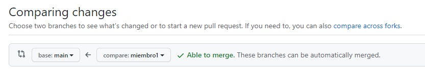

Comandos y forma de trabajar en grupos con GitHub

## Comandos importantes

-Clonar un repositorio en local:
```
	git clone <https://link-con-nombre-del-repositorio>
```

-Crear una rama:
```
	git branch <nombre-de-la-rama>
```
 
-Visualizar las ramas 
```
	git branch --list
```
 
-Cambiar a otra rama
```
	git checkout <nombre-de-la-rama>
``` 
 
-Crear y cambiar de rama
```
	git checkout -b <nombre-de-la-rama>
```

-Actualizar datos locales
```
	git fetch
```

-Descargar datos del repositorio
```
	git pull <nombre-remoto> <nombre-rama>
```
 *normalmente git pull origin <nombre-de-la-rama

-Subir cambios realizados
```
	git push <nombre-remoto> <nombre-rama>
``` 
 *normalmente git push origin <nombre-de-la-rama)
 
-Mostrar últimos commits de la rama actual
```
	git log
```
 
-Registrar cambios para hacer después hacer un commit
```
	git add -A
```
 *con -A se registran todos los cambios, pero también podemos hacerlo por ficheros con git add <nombre-archivo>

-Hacer commit de los cambios registrados
```
	git commit -m “mensaje que resume los cambios”
```
 
-Actualizar tu rama descargan commits de otra rama
```
	git rebase <nombre-remoto> <nombre-rama>
```

## Comandos avanzados

-Guardar cambios registrados pero sin commitear en una pila local
```
	git stash
``` 
 *permite mover cambios de rama o reservarlos. Tiene comandos para usar los cambios guardados en la pila como: git stash apply, git stash pop 

-Eliminar commits en ramas locales
```
	git reset HEAD~<nºcommits a eliminar>
```
 *existen varias opciones de reset como por ejemplo --soft y --hard. Con --soft eliminaremos los commits pero los cambios seguirán estando, esto permite rehacer los commits o guardar los cambios en una pila. Por su parte la opción --hard elimina los commits indicados y además elimina los cambios. Hay que tener mucho cuidado al usar este comando.

## Recomendación de forma de trabajar

El grupo tendrá al menos tantas ramas de trabajo como miembros del grupo + 2. En un grupo de 4 tendremos las siguientes 6 ramas:

 - ```master```
 
 - ```io-pages```
 
 - ```miembro1```
 
 - ```miembro2```
 
 - ```miembro3```
 
 - ```miembro4```
 

A la hora de trabajar, los miembros deben actualizar siempre su rama local con el master del repositorio para asegurarse de tener los últimos cambios del proyecto. Para ellos por ejemplo el miembro 1 cuando vaya a trabajar en algo del proyecto hará:
 
 - ```git fetch``` //actualizamos la información que tenemos sobre el repositorio
 
 - ```git checkout miembro1``` //nos cambiamos a nuestra rama si no estamos en ella
 
 - ```git rebase origin master``` //actualizamos nuestra rama con lo nuevo que haya en la rama master del repositorio
 
 - trabajamos en los archivos locales
 
 - ```git add -A``` //registramos los cambios
 
 - ```git commit -m “nuevo_commit”``` //creamos un commit
 
 - ```git push origin miembro1``` //subimos nuestro commit con los cambios a nuestra rama del repositorio
 
 - ahora desde github se debe crear una pull request contra la rama master, otro miembro debe revisar los cambios y aceptarlos para que pasen a formar parte de master
 
 - si la rama master tiene cambios que se quieren desplegar, se debe actualizar la rama io-pages con el master (puede ser mediante PR o actualizando la rama en local y subiendo los cambios

## Creando PRs

Una *Pull Request* (PR) es la acción de validar un código que se va a mergear de una rama a otra

Para crear una PR seguimos los siguientes pasos:

 - Pulsamos en la pestaña “Pull requests” y luego en el botón verde “New pull request”

	

 - Seleccionamos de “base:” la rama que queremos actualizar y de “compare:” la rama actualizada con nuestros cambios

	

 - Esto mostrará los commits que son nuevos y no tiene la rama seleccionada como “base”. Si está todo bien pulsamos sobre “Create pull request”

 - Ponemos una descripción del pull request y un título y volvemos a pulsar en “Create pull request”.
 
 - Ya solo queda aceptar y “mergear” el pull request.

	
