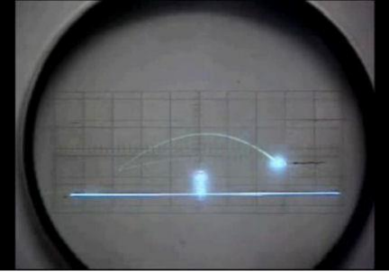
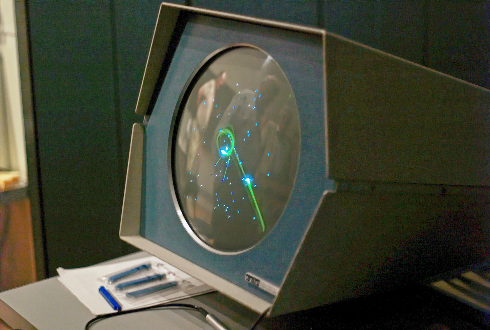
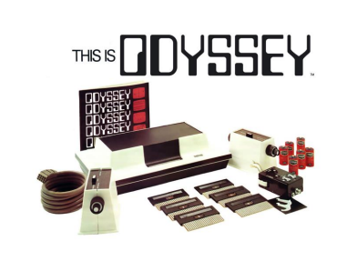
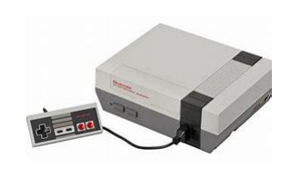
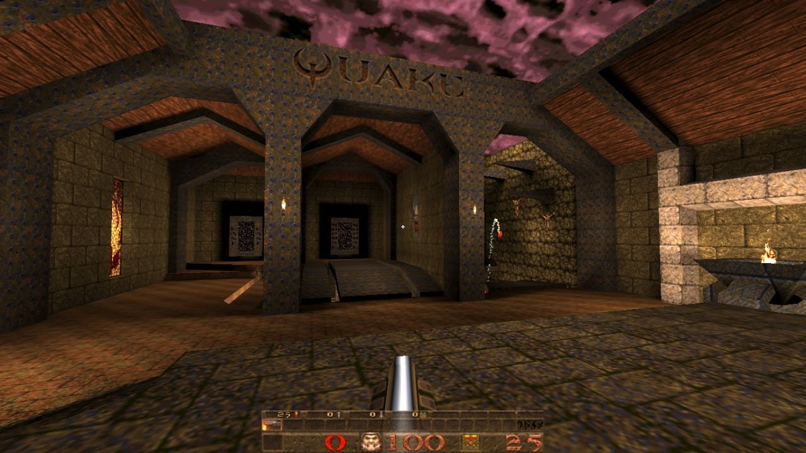
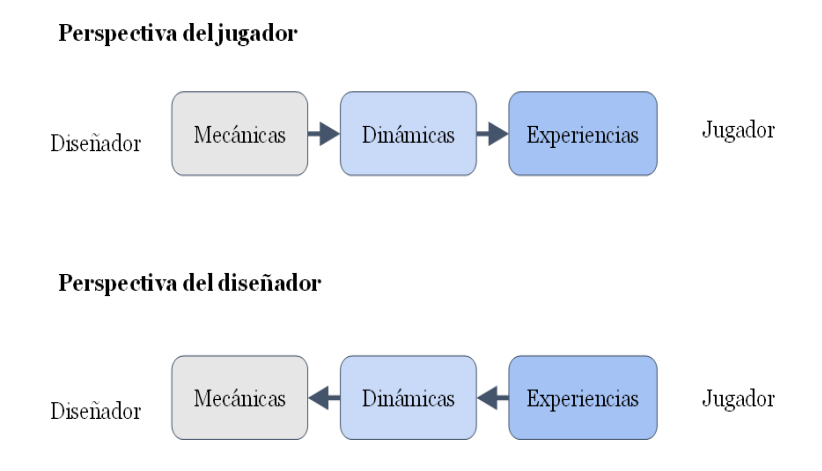

# ¿Qué es un videojuego?

---

## Etimológicamente

- Video: Soporte
- Juego:
"Acción libre ejecutada 
**como si** y sentida como situada fuera de la vida corriente, 
pero que a pesar de todo puede absorber por completo al 
jugador"

(Homo Ludens – J Huizinga)

---

## ¿Qué caracteriza a un juego?

- Objetivo (Propósito)
- Reglas: normas que definan la acción y los límites de esta
- Retos: Algún tipo de dificultad a superar 
- Refuerzos y castigos: El jugador debe saber cuando lo hace bien y cuando mal

---

## Géneros

Igual que en las películas. Juegos que tienen ciertas características comunes que permite englobarlos en un mismo género. Jerarquía de géneros...

- Algunos: Plataformas, acción, beat 'em ups, lucha
- Tipos de cámara: primera, tercera, cenital, isométrica, lateral, on-rail....

# Historia de los videojuegos

---

## Los inicios

- Primer videojuego OXO (1955) => tres en raya

- Tennis for two (1958) (Formalmente)

---

- Spacewar (1962) (en el MIT)
    - Todo era campo y solo universidades...

{width=80%}

---

## Comienzan las consolas

- La primera “consola” Magnavox Odyssey (1972)

- Atari/Sears Telegames Pong

- Color TV-Game (Nintendo) (6 variaciones del tennis)

---

## Segunda generación de consolas (1977)

- Se caracterizan por permitir cartuchos  intercambiables
- Atari, coleco visión, 
- Empezó muy bien perooo...
- Fuerte Crack de los videojuegos (calidad penosa)

{width=60%}

---

## Tercera Generación de consolas

- Nes, Master System
- Resurgimiento y aparición de Nintendo con toda su fuerza
- Sega comienza también a asomar la patita
- Preludio de la guerra de consolas de los 90

---

## Cuarta generación de consolas (Los 16 Bits)
- Hasta ahora los procesadores era de 8 bits.
- Ahora surgen procesadores de 16 bits
- Pasar de 8 a 16 bits tenía implicaciones. A partir de 32..
- Super Nintendo, Mega Drive (Genesis), Turbografx16, Neo Geo
- Máquina arcade en tu hogar

---

## La era 3D

- Primer juego considerado 3D o pseudo 3D: Knight Lore, Spectrum en perspectiva isométrica 3D (Ultimate => Rare)
- Máquinas arcade (Virtua Racing)
- Algunos intentos en los 16 bits (V racing, Star Fox)
- PC: 1992( ID Software: wolfenstain 3D, DooM) (Pseudo 3D)

---

## El 3D "casi" como lo conocemos hoy

- Quake (1996), Quake II / Half life
- Playstation (1995), Sega Saturn (1994) Nintendo 64 (1996) (32 Bits*) (Super Mario 64, Tomb Raider, Metal Gear Solid, Tekken...)
{width=60%}

---

## Las consolas portátiles

- GameBoy (1989)
- Atari Linx
- Game Gear
- GameBoy advance
- PSP
- Las modernas: Vita, Switch, "SteamDeck" ...

---

## La irrupción del PC

- Época dorada 1996-2002
- Aparición de las aceleradoras gráficas (3DFX, Nvidia TNT) => GPUS (Gfoce 256) Aceleración de geometría
- Shaders programables => GeForce 3 (2001)

---

## Consolas con shaders programables

- Xbox (SD)
- Xbox 360 (HD) en adelante
- PS3 (HD) en adelante
- Wii u en adelante

---

## La GPU cada vez cobra más protagonismo

- GPGPU: Physx, Compuiter Units (DX 10 en adelante => Wii u primera consola)
- Teselación (DX 11 en adelante, Xbox 360*, ps4/one en adelante)
- Raytracing (Dx 12 ultimate, ps5, series X en adelante, Nvidia RTX)
- Deep learning (Nvidia RTX)

---

## Juego en red y detección de movimiento

- Pionero el PC (DooM)
- Primera consola Dreamcast, Xbox y luego PS2.
- Nace el concepto de E-Sport (Blizzard con Starcraft 1998)
- Wii, Kinect, Move, sensores...

---

## En la actualidad

- VR
- Nube
- Plataformas digitales (Steam)

# Roles en el desarrollo de juegos

---

## 3 perfiles básicos y multiples adicionales

- Diseñador: El que idea el juego
- Programador: El que lo implementa
- Artista: el que aporta los assets gráficos
- Otros: Sonido, guion, marketing, producción, etc...

---

## Game Designer

Es el encargado de diseñar la experiencia de juego

- Describe las reglas
- La lógica
- Narrativa
- Ambientación

--- 

## Habilidades de un diseñador

- Capacidad de comunicación
- Buena comunicación escrita
- Conocimientos informáticos. Cuantos más mejor
- Conocimientos de hardware
- Nociones de arte
- Inglés.

---

## Algunos Diseñadores Famosos.

- Miyamoto (Nintendo) : Super Mario Bros, Zelda
- Peter Molyneux (Microsoft, Lionhead Studios, Bullfrog): Populous, Black & White
- Ken Levine (Irrational games): Bioshock
- American McGee (ID software): Doom, Quake, Alice: Madness Returns
- Kim Swift (Valve): Portal
- Robin Walker (Valve): Half Life 1, 2, Alyx, Portal
- Jonh Romero (ID Software): DooM, Quake
- Hideo Kojima (Konami): Metal Gear Solid

--- 

## ¿Conocéis algunos más vosotros?

Tarea para casa, buscar un diseñador de vuestro juego favorito y el próximo día lo comentamos

# Elementos formales del diseño de videojuegos

---

## Información disponible

- Pública: El jugador tiene información completa sobre el juego
- Oculta: Información oculta para otros jugadores. La más común
- Privada: Hay parte de información oculta pero se puede revelar
- Privilegiada: Un jugador tiene toda la información y el resto menos
- Compartida: Cuando se decide compartir información de forma voluntaria

---

## Conceptos

- Recursos: Vida, munición, moneda
- Objetivos: Salvar a la princesa en Mario (puede haber secundarios)
- Ambientación: entorno donde se juega.
- Avatar: el representante virtual del jugador en el juego.
- Reglas: conjunto de posibilidades de interacción de los 
jugadores con el juego (implícitas y explicitas)

---

## Modelo MDA

- Mecánicas: acciones que el jugador puede llevar a cabo en el juego
- Dinámicas: resultado de combinar diferentes 
mecánicas (Estrategias)
- Experiencias (Aesthetics): las sensaciones que el jugador experimenta al jugar

---

## MDA según la perspectiva

---

## Documentos de Diseño

- Documento de concepto (a veces llamado Pitch)
- EL GDD (Game Design Document)
- No tiene porqué ser un único documento (Wiki por ejemplo)
- Objetivo: Tener una descripción con el suficiente grado de detalle como para permitir una implementación

---

## GDD detallista
- A favor:
    - Permite separar la especificación de la implementación
    - Permite que la validación final tenga sentido
    - Encuentra alguno de los problemas anticipadamente
- En contra:
    - Trabajar en el ‘aire’ significa tirar trabajo
    - Documentos des-actualizados
    - Implementación menos flexible

---

## Feedback
El jugador necesita retroalimentación

- Para saber qué acción ha realizado
- Para saber si la acción realizada ha tenido alguna consecuencia
- Para saber si la consecuencia ha sido positiva o negativa

---

**Cuidado**: Si una acción no genera un feedback relevante la primera vez que se usa. El jugador aprenderá a que hacer esa acción es irrelevante

El feedback debe ser gratificante, espectacular, vistoso, que suene bien, que te sirva para el futuro...

---

## Core loop

Es el conjunto de mecánicas que el jugador debe repetir una y otra vez

" Este juego es en el que tienes que... "

Es lo primero que debe funcionar y la base para que el juego sea bueno. 

---

## Loops de feedback

Positivos: Potencian el feedback positivo (Permiten progresión pero cuidado porque pueden hacerse muy **chetos**)

Negativos: Penalizan la progresión (Pueden percibirse como injustos, pero mantienen la progresión equilibrada)

En el equilibrio de ambos esta el truco :)

---

## ¿Preguntas?