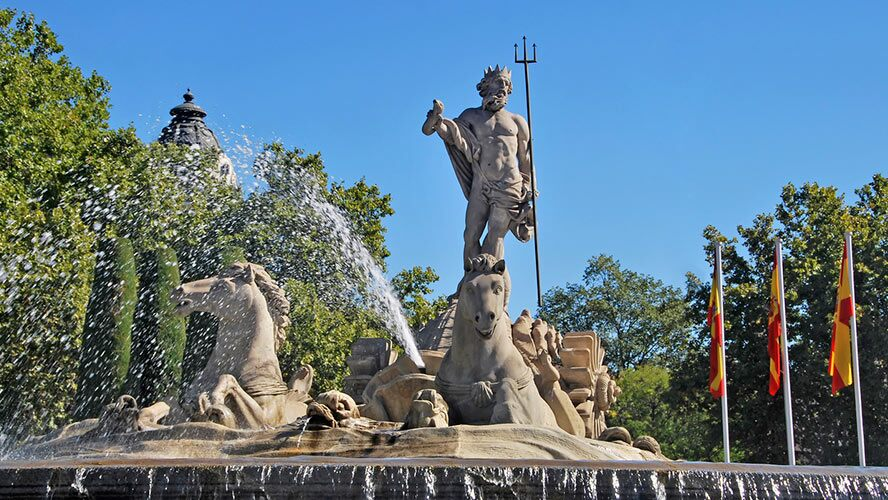
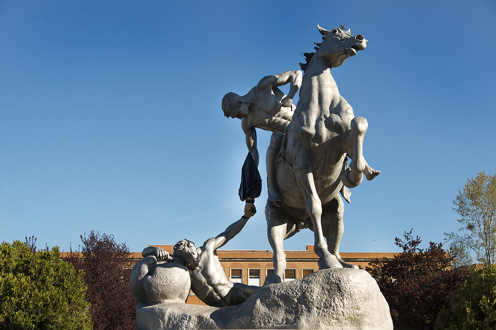

# El tema de este curso 22-23 es... \

---

Primera pista:

---

Segunda pista:

---

Última pista: \
{width=60%}

---

## Estatuas

- Esculturas que representa una figura natural, normalmente humana.
- Evocan dioses, personajes importantes o hitóricos, conceptos de realidad, justicia, superación...
- Son elementos constantes de muchas culturas y sociedades.

---

## Inspiración

- La estatua (visual)
- El ente esculpido (personaje)
- La intención del autor (simbologia)
- El autor de la obra

# Ejemplo motivador

---

Los nazarenos, inspiración para el juego Blasphemous (*The Game Kitchen*)

{width=25%}
{width=40%}

[Podcast RUN con Mauricio García - The Game Kitchen CEO & Producer ](https://open.spotify.com/episode/7gdJsWBXxP5T0I8O0QPFi5?si=A4OO_7y0R6u52ZdNTluPgw&utm_source=copy-link&nd=1)