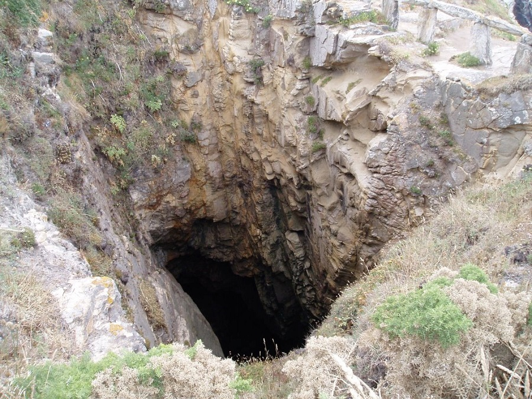
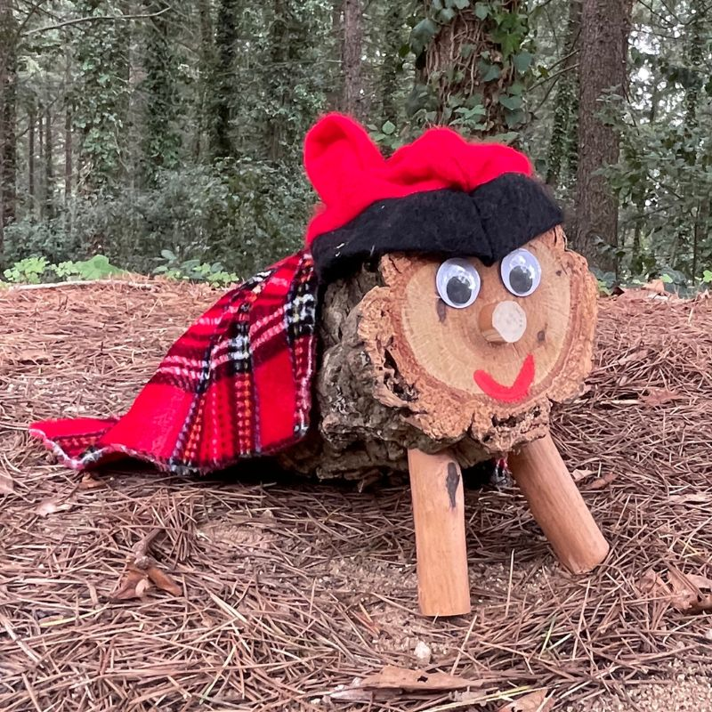
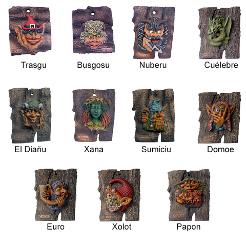
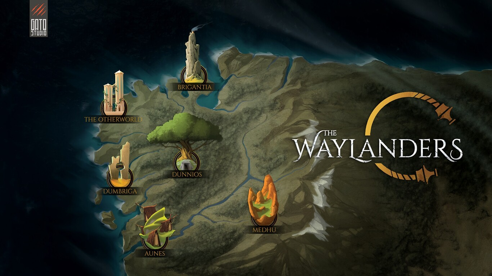

# El tema de este curso 22-23 es... \

---

Primera pista: \
{width=60%}

---

Segunda pista: \
{width=60%}

---

Última pista: \
{width=60%}

---

## Mitología y folclore (de España)

- Elegir una región de España.
- Investigar sobre su folclore y su mitología...

---

## Inspiración

- Lugares
- Personajes
- Criaturas
- Fábulas
- Leyendas

# Ejemplo motivador

---

The Waylanders (*Gato Studio*)

{width=60%}

[Artículo en Xataka](https://www.xataka.com/videojuegos/the-waylanders-juego-rol-made-in-galicia-que-aspira-a-convertirse-nuevo-dragon-age)